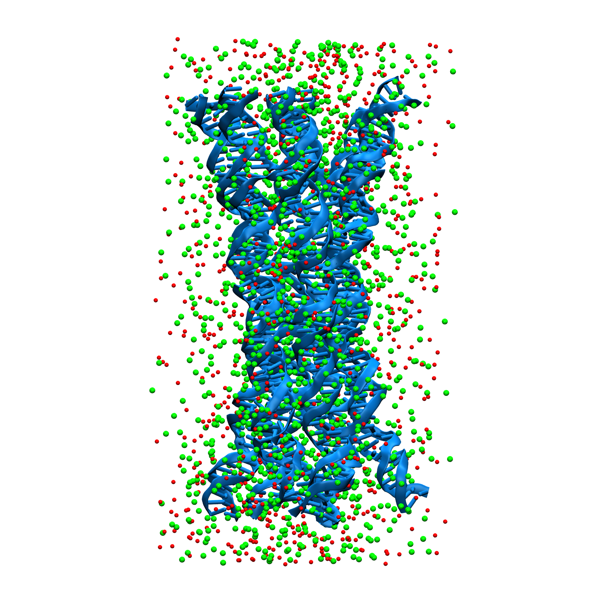

# Nucleic Acid Nanostructures

  

A custom script for AmberTools to construct and design nucleic acid nanostructures. This tool simplifies the creation of complex DNA/RNA architectures for molecular modeling and simulation workflows.
You need to install amber tools to run this code. 

# Nucleic acid Modeling with NAB (AMBER Tools)

This repository contains a NAB (Nucleic Acid Builder) script for generating Nucleic acid structures with specific rise, twist, and sequence parameters using AMBER Tools. The script outputs PDB files of modeled Nucleic acid helices and assembled Nucleic acid complexes.

## Features
- Generate Nucleic acid helices with custom sequences and geometric parameters.
- Assemble Nucleic acid complexes with multiple strands.
- Outputs PDB files for further analysis or visualization.

## Requirements
- **AMBER Tools**: The NAB script requires AMBER Tools to run. You can download and install it from [AMBER's official site](https://ambermd.org/).
- A working knowledge of NAB scripting language is helpful but not required.

## Script Overview
The script defines the following:
- **Rise**: Helical rise per residue (for DNA: `3.38 Å` and for RNA: `2.81 Å`).
- **Twist**: Helical twist per residue (for DNA: `36.0°` and for RNA: `32.7°`).
- **Nucleic acid Sequences**: Multiple Nucleic acid strands with custom sequences are specified and assembled.
- **Outputs**:
  -  Intermediate structures with pdb files.
  -  Run the xleap file using xleap -f xleap.dat to generate the final structure
 

## Citing This Work
If you are using this code, consider citing these articles:
- S. Naskar, M. Gosika, H. Joshi, P. K. Maiti; "Tuning the Stability of DNA Nanotubes with Salt", *Journal of Physical Chemistry C*, 2019, **123**(14), 9461-9470. 
- S. Naskar, H. Joshi, B. Chakraborty, N. C. Seeman, P. K. Maiti; "Atomic Structures of RNA nanotubes and comparison with DNA nanotubes", *Nanoscale*, 2019, **11**(31), 14863-14878. 
- S. Naskar, P. K. Maiti; "Mechanical properties of DNA and DNA nanostructures: comparison of atomistic, Martini, and oxDNA", *Journal of Materials Chemistry B*, 2021, **9**(25), 5102-5113.
